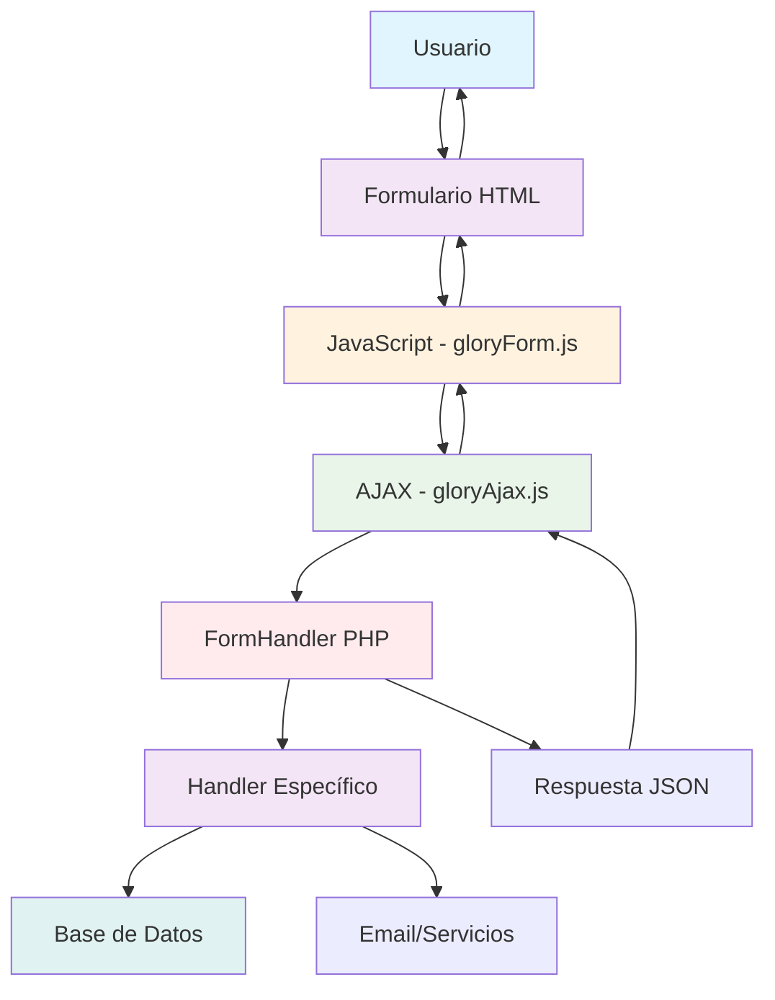
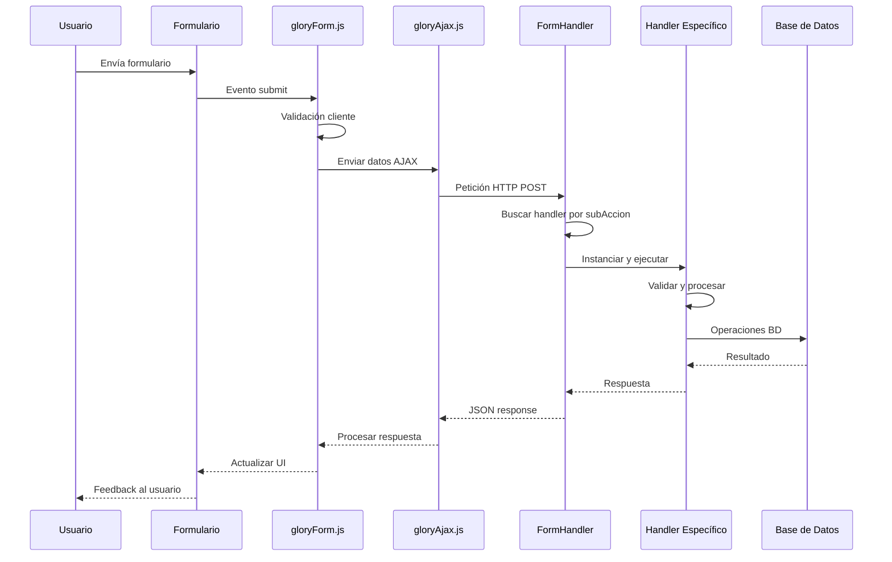

import { Tabs, TabItem } from '@astrojs/starlight/components';

# 🏗️ Sistema de Formularios - Arquitectura Completa

El **Sistema de Formularios** de Glory Framework es una solución integral para crear, procesar y gestionar formularios web de manera segura, escalable y mantenible. Combina componentes del lado cliente y servidor para proporcionar una experiencia de desarrollo fluida.

## 🎯 Características Principales

- ✅ **Generación automática de HTML** - Sin escribir markup repetitivo
- ✅ **Validación dual** - Cliente y servidor con consistencia
- ✅ **Envío AJAX automático** - Sin recargas de página
- ✅ **Manejo de archivos** - Subida nativa con validación
- ✅ **Sistema de handlers** - Procesamiento modular del servidor
- ✅ **Seguridad integrada** - Sanitización y validación automática
- ✅ **Logging completo** - Trazabilidad de todas las operaciones
- ✅ **Extensibilidad** - Fácil creación de formularios personalizados

## 🏛️ Arquitectura del Sistema

### Componentes Principales



### 1. **FormBuilder (Generador de HTML)**

**Ubicación**: `Glory/src/Components/FormBuilder.php`

Genera automáticamente el HTML de los formularios con:
- Campos de entrada validados
- Atributos de accesibilidad
- Estructura semántica
- Integración con JavaScript

### 2. **gloryForm.js (Validación Cliente)**

**Ubicación**: `Glory/assets/js/genericAjax/gloryForm.js`

Maneja:
- Validación del lado cliente
- Eventos de formulario
- Estados de carga
- Feedback visual

### 3. **gloryAjax.js (Comunicación)**

**Ubicación**: `Glory/assets/js/genericAjax/gloryAjax.js`

Proporciona:
- Envío AJAX unificado
- Manejo de errores
- Estados de carga
- Transformación de respuestas

### 4. **FormHandler (Router del Servidor)**

**Ubicación**: `Glory/src/Handler/FormHandler.php`

Sistema de routing que:
- Encuentra el handler apropiado
- Gestiona el ciclo de vida
- Maneja errores
- Registra operaciones

### 5. **Handlers Específicos**

**Ubicación**: `App/Handlers/Form/` (personalizados) o `Glory/Handler/Form/` (incluidos)

Clases que procesan lógica específica:
- Validación de negocio
- Interacción con BD
- Envío de emails
- Integración con APIs

## 🔄 Flujo Completo de un Formulario

### Diagrama de Secuencia



### Ejemplo Práctico Completo

<Tabs>
  <TabItem label="Formulario HTML (PHP)">
```php
<?php
use Glory\Components\FormBuilder;

// Crear formulario de contacto
$formulario = new FormBuilder('contacto');
$formulario->action('gloryFormHandler')
          ->method('POST')
          ->addHidden('subAccion', 'ProcesarContacto')
          ->addText('nombre', 'Nombre completo', ['required' => true])
          ->addEmail('email', 'Correo electrónico', ['required' => true])
          ->addTextarea('mensaje', 'Mensaje', [
              'required' => true,
              'rows' => 4
          ])
          ->addButton('enviar', 'Enviar mensaje', [
              'type' => 'submit',
              'class' => 'btn btn-primary'
          ])
          ->render();
?>
```
  </TabItem>

  <TabItem label="JavaScript (Cliente)">
```javascript
document.addEventListener('DOMContentLoaded', function() {
    // gloryForm.js maneja automáticamente la validación y envío
    // Pero podemos añadir comportamiento personalizado

    const form = document.getElementById('contacto');

    // Antes de enviar
    form.addEventListener('gloryForm:beforeSubmit', function(e) {
        console.log('Enviando formulario de contacto...');
        mostrarSpinner();
    });

    // Éxito
    form.addEventListener('gloryForm:success', function(e) {
        console.log('Mensaje enviado:', e.detail);
        ocultarSpinner();
        mostrarMensajeExito(e.detail.message);
        form.reset();
    });

    // Error
    form.addEventListener('gloryForm:error', function(e) {
        console.error('Error:', e.detail);
        ocultarSpinner();
        mostrarMensajeError(e.detail.message);
    });
});
```
  </TabItem>

  <TabItem label="Handler (Servidor)">
```php
<?php
namespace App\Handlers\Form;

use Glory\Handler\Form\FormHandlerInterface;

class ProcesarContactoHandler implements FormHandlerInterface
{
    public function procesar(array $postDatos, array $archivos): array
    {
        // 1. Validar datos
        $this->validarDatos($postDatos);

        // 2. Procesar contacto
        $resultado = $this->procesarContacto($postDatos);

        // 3. Logging
        GloryLogger::info('Contacto procesado', [
            'email' => $postDatos['email']
        ]);

        // 4. Respuesta
        return [
            'alert' => '¡Mensaje enviado correctamente!',
            'contactId' => $resultado['id']
        ];
    }

    private function validarDatos(array $datos): void
    {
        $requeridos = ['nombre', 'email', 'mensaje'];

        foreach ($requeridos as $campo) {
            if (empty($datos[$campo])) {
                throw new \Exception("Campo {$campo} es obligatorio");
            }
        }

        if (!is_email($datos['email'])) {
            throw new \Exception('Email inválido');
        }
    }

    private function procesarContacto(array $datos): array
    {
        // Enviar email
        $asunto = "Nuevo contacto: {$datos['nombre']}";
        $mensaje = "De: {$datos['nombre']} ({$datos['email']})\n\n{$datos['mensaje']}";

        wp_mail(
            get_option('admin_email'),
            $asunto,
            $mensaje
        );

        return ['id' => uniqid('contact_')];
    }
}
```
  </TabItem>
</Tabs>

## 🎨 Beneficios del Sistema

### Para Desarrolladores

- **Rapidez**: Formularios complejos en minutos
- **Consistencia**: Mismo patrón para todos los formularios
- **Mantenibilidad**: Código organizado y reutilizable
- **Seguridad**: Validación automática y sanitización
- **Debugging**: Logging completo y herramientas de desarrollo

### Para Usuarios

- **Experiencia fluida**: Sin recargas de página
- **Feedback inmediato**: Validación en tiempo real
- **Accesibilidad**: Formularios semanticamente correctos
- **Responsive**: Diseño adaptativo automático

## 🔧 Configuración y Activación

### Activación del Sistema

```php
// En functions.php o archivo de configuración
OpcionManager::register('glory_componente_glory_form_activado', [
    'type' => 'checkbox',
    'label' => 'Activar sistema de formularios AJAX',
    'description' => 'Permite procesamiento de formularios vía AJAX',
    'default' => true,
    'section' => 'glory_ajax'
]);

OpcionManager::register('glory_componente_glory_ajax_activado', [
    'type' => 'checkbox',
    'label' => 'Activar utilidad AJAX',
    'description' => 'Habilita gloryAjax.js para comunicaciones',
    'default' => true,
    'section' => 'glory_ajax'
]);
```

### Verificación de Estado

```php
// Verificar que el sistema esté activo
if (GloryFeatures::isActive('gloryForm', 'glory_componente_glory_form_activado')) {
    // Sistema de formularios disponible
}

if (GloryFeatures::isActive('gloryAjax', 'glory_componente_glory_ajax_activado')) {
    // Utilidad AJAX disponible
}
```

## 📋 Tipos de Formularios Soportados

### Formularios Básicos

- **Contacto**: Formularios de contacto con validación de email
- **Registro**: Creación de cuentas de usuario
- **Login**: Autenticación de usuarios
- **Newsletter**: Suscripción a boletines

### Formularios Avanzados

- **Creación de contenido**: Posts, páginas, CPTs
- **Edición masiva**: Operaciones en lote
- **Importación/Exportación**: Gestión de datos
- **Configuración**: Opciones y preferencias

### Formularios con Archivos

- **Subida de imágenes**: Galerías y avatares
- **Documentos**: PDFs, documentos de oficina
- **Medios**: Audio, video, archivos multimedia

## 🔒 Seguridad Integrada

### Sanitización Automática

```php
// Los datos llegan automáticamente sanitizados
public function procesar(array $postDatos, array $archivos): array
{
    // $postDatos['email'] ya está sanitizado con sanitize_email()
    // $postDatos['mensaje'] ya está sanitizado con sanitize_textarea_field()
    // $postDatos['titulo'] ya está sanitizado con sanitize_text_field()
}
```

### Validación de Permisos

```php
public function procesar(array $postDatos, array $archivos): array
{
    // Verificar permisos automáticamente
    if (!current_user_can('publish_posts')) {
        throw new \Exception('Permisos insuficientes');
    }

    // Verificar ownership si aplica
    $postId = $postDatos['postId'] ?? 0;
    if ($postId && get_post_field('post_author', $postId) != get_current_user_id()) {
        throw new \Exception('No eres el autor de esta publicación');
    }
}
```

### Protección CSRF

```php
// El sistema maneja nonces automáticamente
$formulario->addHidden('nonce', wp_create_nonce('mi_form_nonce'));

// En el handler
if (!wp_verify_nonce($postDatos['nonce'], 'mi_form_nonce')) {
    throw new \Exception('Token de seguridad inválido');
}
```

## 📊 Monitoreo y Analytics

### Logging Automático

El sistema registra automáticamente:
- Envío de formularios
- Procesamiento exitoso
- Errores y excepciones
- Tiempos de respuesta
- Datos de usuario (opcional)

### Métricas Disponibles

```php
// Obtener estadísticas de formularios
$estadisticas = GloryLogger::getFormStatistics([
    'handler' => 'ProcesarContacto',
    'fecha_desde' => '2024-01-01',
    'fecha_hasta' => '2024-12-31'
]);

// Resultado incluye:
// - total_envios
// - exitos
// - errores
// - tiempo_promedio_respuesta
// - tipos_error_mas_comunes
```

## 🚀 Casos de Uso Avanzados

### Formularios Multi-paso

```php
class FormularioMultipasoHandler implements FormHandlerInterface
{
    public function procesar(array $postDatos, array $archivos): array
    {
        $paso = intval($postDatos['paso'] ?? 1);
        $datosAcumulados = json_decode($postDatos['datos_acumulados'] ?? '{}', true);

        switch ($paso) {
            case 1:
                return $this->procesarPaso1($postDatos, $datosAcumulados);
            case 2:
                return $this->procesarPaso2($postDatos, $datosAcumulados);
            case 3:
                return $this->procesarPasoFinal($postDatos, $datosAcumulados);
        }
    }
}
```

### Formularios Condicionales

```php
// JavaScript para campos condicionales
document.addEventListener('change', function(e) {
    if (e.target.name === 'tipo_usuario') {
        const camposEmpresa = document.querySelectorAll('.campo-empresa');
        const esEmpresa = e.target.value === 'empresa';

        camposEmpresa.forEach(campo => {
            campo.style.display = esEmpresa ? 'block' : 'none';
            campo.querySelector('input').disabled = !esEmpresa;
        });
    }
});
```

### Integración con APIs Externas

```php
class IntegracionAPIHandler implements FormHandlerInterface
{
    public function procesar(array $postDatos, array $archivos): array
    {
        // Procesar datos localmente primero
        $datosLocal = $this->procesarLocalmente($postDatos);

        // Enviar a API externa
        $respuestaAPI = $this->enviarAApiExterna($datosLocal);

        // Actualizar base de datos local
        $this->actualizarBDLocal($respuestaAPI);

        return [
            'alert' => 'Datos sincronizados correctamente',
            'api_response' => $respuestaAPI
        ];
    }
}
```

## 🛠️ Extensibilidad

### Crear Componentes Personalizados

```php
// Extender FormBuilder
class MiFormBuilder extends FormBuilder
{
    public function addMiCampoPersonalizado($nombre, $label, $opciones = [])
    {
        // Lógica para campo personalizado
        return $this;
    }
}
```

### Hooks y Filtros Disponibles

```php
// Antes de procesar formulario
add_filter('glory_form_before_process', function($datos, $handler) {
    // Modificar datos o validaciones adicionales
    return $datos;
}, 10, 2);

// Después de procesar exitosamente
add_action('glory_form_success', function($resultado, $handler, $datosOriginales) {
    // Acciones adicionales como envío de emails, logging, etc.
}, 10, 3);

// En caso de error
add_action('glory_form_error', function($error, $handler, $datosOriginales) {
    // Manejo de errores personalizado
}, 10, 3);
```

## 📚 Mejores Prácticas

### Estructura de Código

```
App/
├── Handlers/
│   └── Form/
│       ├── ContactoHandler.php
│       ├── RegistroHandler.php
│       └── PedidoHandler.php
└── Templates/
    └── forms/
        ├── contacto.php
        ├── registro.php
        └── pedido.php
```

### Nomenclatura

- **Handlers**: `{Accion}Handler.php`
- **Formularios**: `form-{tipo}.php`
- **IDs**: `form-{tipo}-{instancia}`
- **Clases CSS**: `.form-{tipo}`, `.campo-{nombre}`

### Testing

```php
// Test básico de handler
public function testProcesamientoContacto()
{
    $handler = new ContactoHandler();
    $datos = [
        'nombre' => 'Juan Pérez',
        'email' => 'juan@example.com',
        'mensaje' => 'Mensaje de prueba'
    ];

    $resultado = $handler->procesar($datos, []);

    $this->assertArrayHasKey('alert', $resultado);
    $this->assertEquals('¡Mensaje enviado correctamente!', $resultado['alert']);
}
```

## 🔍 Solución de Problemas

### Problemas Comunes

**Formulario no se envía:**
- Verificar que `gloryAjax.js` esté cargado
- Comprobar configuración de `action` y `subAccion`
- Revisar validación del lado cliente

**Handler no encontrado:**
- Verificar nomenclatura: `{SubAccion}Handler`
- Comprobar namespace registrado
- Revisar ubicación del archivo

**Errores de validación:**
- Verificar reglas de validación en handler
- Comprobar sanitización automática
- Revisar logs para detalles

### Herramientas de Debug

```php
// Modo debug para formularios
define('GLORY_FORM_DEBUG', true);

// Logging detallado
GloryLogger::setLevel('debug');
```

---

El Sistema de Formularios de Glory Framework proporciona una base sólida para crear interfaces web interactivas y seguras. Su arquitectura modular permite desarrollar rápidamente funcionalidades complejas mientras mantiene el código organizado y mantenible.
