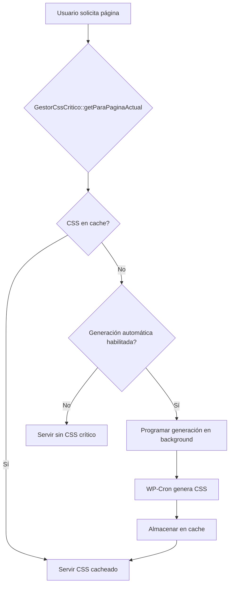

import { Steps, Tabs, TabItem, Aside } from '@astrojs/starlight.components';

# GestorCssCritico

El **GestorCssCritico** es un servicio avanzado para la gestión automática de CSS crítico en aplicaciones WordPress. Optimiza el rendimiento web al extraer y servir el CSS necesario para renderizar el contenido visible inicialmente (above the fold), reduciendo significativamente el tiempo de renderizado bloqueante.

## Filosofía

GestorCssCritico está diseñado para ser:
- **Automático**: Genera y sirve CSS crítico sin intervención manual
- **Inteligente**: Cachea por URL y post, con fallbacks inteligentes
- **Escalable**: Maneja múltiples páginas y tipos de contenido
- **No intrusivo**: Funciona con cualquier tema y configuración

## Características Principales

- **Generación automática**: Crea CSS crítico en background cuando es necesario
- **Cache inteligente**: Almacena CSS por URL exacta o por post ID
- **Modos flexibles**: Soporte para generación local y remota
- **Admin UI**: Interfaz de administración para control manual
- **Invalidación automática**: Limpia cache cuando se actualiza contenido
- **Navegación AJAX**: Se desactiva automáticamente en modo no-AJAX

## Arquitectura

### Componentes del Sistema

1. **GestorCssCritico**: Servicio principal de gestión y orquestación
2. **LocalCriticalCss**: Generador local usando Node.js y Puppeteer
3. **API Remota**: Integración con servicios externos de generación
4. **Admin Interface**: Controles en la barra de administración
5. **Cache System**: Sistema de cache basado en WordPress transients

### Flujo de Funcionamiento



## Configuración Inicial

### Activación del Servicio

```php
use Glory\Services\GestorCssCritico;

// Inicializar el servicio (se hace automáticamente en Glory)
GestorCssCritico::init();
```

### Opciones de Configuración

Configura las opciones en el panel de administración del tema:

```php
// En functions.php o configuración del tema
OpcionManager::register('glory_css_critico_activado', [
    'type' => 'checkbox',
    'label' => 'Activar CSS Crítico',
    'description' => 'Optimizar rendimiento con CSS crítico',
    'default' => false,
    'section' => 'glory_performance'
]);

OpcionManager::register('glory_css_critico_auto', [
    'type' => 'checkbox',
    'label' => 'Generación Automática',
    'description' => 'Generar CSS crítico automáticamente en background',
    'default' => true,
    'section' => 'glory_performance'
]);

OpcionManager::register('glory_critical_css_mode', [
    'type' => 'select',
    'label' => 'Modo de Generación',
    'options' => [
        'local' => 'Local (Node.js)',
        'remote' => 'Remoto (API)'
    ],
    'default' => 'local',
    'section' => 'glory_performance'
]);
```

## Generación de CSS Crítico

### Modo Local (Recomendado)

```php
// Configuración automática - no requiere intervención
$config = [
    'url' => home_url('/'),
    'cssDir' => get_template_directory() . '/App/Assets/css',
    'timeout' => 60000,
    'renderWait' => 800,
    'skipLoadAfter' => 20000
];

// El servicio maneja todo automáticamente
$cssCritico = LocalCriticalCss::generate($url);
```

### Modo Remoto

```php
// Configurar endpoint remoto
OpcionManager::set('glory_critical_css_api_url', 'https://api.css-critical.com/generate');
OpcionManager::set('glory_critical_css_api_backup_url', 'https://backup.css-critical.com/generate');

// El servicio elige automáticamente el modo configurado
$cssCritico = GestorCssCritico::generarParaUrl($url);
```

## Uso Programático

### Obtener CSS para la Página Actual

```php
// En el header del tema (functions.php o header.php)
add_action('wp_head', function() {
    $cssCritico = GestorCssCritico::getParaPaginaActual();

    if ($cssCritico) {
        echo "<style id=\"glory-critical-css\">$cssCritico</style>\n";
    }
}, 5); // Ejecutar temprano, antes de otros estilos
```

### Generación Manual para URLs Específicas

```php
// Generar CSS crítico para una URL específica
$url = home_url('/contacto/');
$css = GestorCssCritico::generarParaUrl($url);

if ($css) {
    // Almacenar para uso posterior
    GestorCssCritico::guardarCssParaUrl($url, $css);
    echo "CSS crítico generado: " . strlen($css) . " bytes\n";
}
```

### Gestión de Cache

```php
// Limpiar toda la cache de CSS crítico
add_action('wp_ajax_glory_limpiar_css_critico', function() {
    if (!current_user_can('manage_options')) {
        wp_die('No autorizado');
    }

    global $wpdb;
    $prefijo = $wpdb->esc_like(GestorCssCritico::PREFIJO_CLAVE_CACHE);
    $sql = "DELETE FROM {$wpdb->options} WHERE option_name LIKE '_transient_{$prefijo}%'";

    $wpdb->query($sql);
    wp_send_json_success('Cache de CSS crítico limpiado');
});

// Limpiar cache de un post específico
add_action('save_post', function($postId) {
    if (wp_is_post_revision($postId)) {
        return;
    }

    $claveCache = GestorCssCritico::PREFIJO_CLAVE_CACHE . $postId;
    delete_transient($claveCache);
});
```

## Interfaz de Administración

### Barra de Administración

El servicio agrega automáticamente controles a la barra de administración de WordPress:

```php
// Se registra automáticamente en init()
add_action('admin_bar_menu', [GestorCssCritico::class, 'registrarMenuAdminBar'], 100);
```

**Controles disponibles:**
- **CSS crítico** (menú principal)
  - **Limpiar caché CSS crítico**: Elimina toda la cache almacenada
  - **Generar (esta página)**: Crea CSS crítico para la página actual
  - **Generar para todas (background)**: Programa generación para todas las páginas

### Estado del Sistema

```php
// Ver estado de generación para todas las páginas
add_action('wp_ajax_glory_generar_css_critico_all', function() {
    if (!current_user_can('manage_options')) {
        wp_send_json_error('No autorizado');
    }

    // Obtener todas las páginas y posts publicados
    $urls = [home_url('/')];
    $query = new WP_Query([
        'post_type' => ['page', 'post'],
        'post_status' => 'publish',
        'posts_per_page' => 200,
        'fields' => 'ids'
    ]);

    foreach ($query->posts as $postId) {
        $urls[] = get_permalink($postId);
    }

    // Programar generación en background
    $when = time() + 5;
    foreach (array_unique($urls) as $url) {
        if (!wp_next_scheduled('glory_generate_critical_css_event', [$url])) {
            wp_schedule_single_event($when, 'glory_generate_critical_css_event', [$url]);
            $when += 2; // Espaciar ejecuciones
        }
    }

    wp_send_json_success('Generación programada para ' . count($urls) . ' URLs');
});
```

## Optimizaciones Avanzadas

### Fallbacks de Cache

```php
// El servicio implementa múltiples estrategias de cache:
// 1. Cache exacto por URL
// 2. Cache sin parámetro noAjax
// 3. Cache por path sin query params
// 4. Cache de home canónica

private function getCssCacheado(string $url): ?string
{
    // 1. Intento exacto
    $css = get_transient($this->getClaveCacheParaUrl($url));
    if ($css) return $css;

    // 2. Sin parámetro noAjax
    if (isset($_GET['noAjax'])) {
        $urlSinNoAjax = remove_query_arg('noAjax', $url);
        $css = get_transient($this->getClaveCacheParaUrl($urlSinNoAjax));
        if ($css) return $css;
    }

    // 3. Path canónico
    $path = wp_parse_url($url, PHP_URL_PATH) ?: '/';
    $urlSinQuery = home_url($path);
    if ($urlSinQuery !== $url) {
        $css = get_transient($this->getClaveCacheParaUrl($urlSinQuery));
        if ($css) return $css;
    }

    // 4. Home si es página de inicio
    if (is_front_page() || is_home()) {
        $home = home_url('/');
        $css = get_transient($this->getClaveCacheParaUrl($home));
        if ($css) return $css;
    }

    return null;
}
```

### Prevención de Sobrecarga

```php
// Locks para evitar generación simultánea
private function getLockKey(string $url): string
{
    return self::PREFIJO_LOCK . md5($url);
}

// Solo una generación por URL cada 5 minutos
if (!get_transient($this->getLockKey($url))) {
    set_transient($this->getLockKey($url), 1, 5 * MINUTE_IN_SECONDS);
    wp_schedule_single_event(time() + 5, 'glory_generate_critical_css_event', [$url]);
}
```

### Modo no-AJAX

```php
// Inyectar bandera global para congelar navegación AJAX
add_action('wp_head', function() {
    if (is_admin()) return;

    $noAjax = isset($_GET['noAjax']) && $_GET['noAjax'] === '1';
    if (!$noAjax) return;

    ?>
    <script>
    (function(w){
        // Bandera global para cualquier script que necesite detectar modo congelado
        w.__GLORY_NO_AJAX__ = true;

        // Config de navegación AJAX de Glory: abortar e inhabilitar
        var cfg = w.gloryNavConfig || {};
        cfg.enabled = false;
        cfg.shouldAbortInit = function(){ return true; };
        cfg.shouldSkipAjax = function(){ return true; };
        w.gloryNavConfig = cfg;
    })(window);
    </script>
    <?php
}, 0);
```

## Casos de Uso

### Tema WordPress Optimizado

```php
// En functions.php
add_action('after_setup_theme', function() {
    // Inicializar servicio
    GestorCssCritico::init();

    // Inyectar CSS crítico en el head
    add_action('wp_head', function() {
        $cssCritico = GestorCssCritico::getParaPaginaActual();

        if ($cssCritico) {
            echo "<style id=\"critical-css\">$cssCritico</style>\n";

            // Cargar CSS completo de forma asíncrona
            add_action('wp_footer', function() {
                echo "<link rel=\"preload\" href=\"" . get_stylesheet_uri() . "\" as=\"style\" onload=\"this.onload=null;this.rel='stylesheet'\">\n";
                echo "<noscript><link rel=\"stylesheet\" href=\"" . get_stylesheet_uri() . "\"></noscript>\n";
            });
        } else {
            // Fallback: cargar CSS normalmente
            wp_enqueue_style('theme-styles', get_stylesheet_uri());
        }
    }, 5);
});
```

### E-commerce con Páginas Dinámicas

```php
class CssCriticoEcommerce
{
    public static function init()
    {
        add_action('wp_head', [self::class, 'inyectarCssCritico'], 5);
        add_action('save_post', [self::class, 'limpiarCacheProducto'], 10, 1);
    }

    public static function inyectarCssCritico()
    {
        // Para productos, usar cache por post ID
        if (is_singular('product')) {
            global $post;
            $css = self::getCssParaProducto($post->ID);

            if ($css) {
                echo "<style id=\"critical-css-product\">$css</style>\n";
                return;
            }
        }

        // Para otras páginas, usar el sistema estándar
        $css = GestorCssCritico::getParaPaginaActual();
        if ($css) {
            echo "<style id=\"critical-css\">$css</style>\n";
        }
    }

    private static function getCssParaProducto(int $productId): ?string
    {
        $claveCache = GestorCssCritico::PREFIJO_CLAVE_CACHE . $productId;
        return get_transient($claveCache);
    }

    public static function limpiarCacheProducto(int $postId)
    {
        if (get_post_type($postId) !== 'product') {
            return;
        }

        $claveCache = GestorCssCritico::PREFIJO_CLAVE_CACHE . $postId;
        delete_transient($claveCache);
    }
}

// Inicializar
CssCriticoEcommerce::init();
```

### Integración con Page Builders

```php
// Para temas que usan page builders como Elementor o Avada
class CssCriticoPageBuilder
{
    public static function init()
    {
        // Detectar cambios en contenido de page builder
        add_action('save_post', [self::class, 'limpiarCachePageBuilder'], 10, 1);

        // Inyectar CSS crítico con consideraciones especiales
        add_action('wp_head', [self::class, 'inyectarCssOptimizado'], 5);
    }

    public static function limpiarCachePageBuilder(int $postId)
    {
        // Limpiar cache cuando se edita con page builder
        if (isset($_POST['action']) && $_POST['action'] === 'elementor_ajax') {
            $claveCache = GestorCssCritico::PREFIJO_CLAVE_CACHE . $postId;
            delete_transient($claveCache);
        }
    }

    public static function inyectarCssOptimizado()
    {
        $cssCritico = GestorCssCritico::getParaPaginaActual();

        if ($cssCritico) {
            // Para page builders, agregar clase especial para evitar conflictos
            echo "<style id=\"critical-css\" class=\"glory-critical-css\">$cssCritico</style>\n";

            // Cargar CSS del page builder después
            add_action('wp_enqueue_scripts', function() {
                wp_enqueue_style('page-builder-styles');
            }, 100);
        }
    }
}
```

## Monitoreo y Debugging

### Logging Integrado

```php
// Todas las operaciones se registran automáticamente
// Ejemplos de logs generados:

// [GloryLogger] CssCritico: cache HIT por postId (postId: 123, bytes: 15432)
// [GloryLogger] CssCritico: cache MISS por URL exacta
// [GloryLogger] CssCritico: generación programada por WP-Cron (url: https://example.com/)
// [GloryLogger] CssCritico: cron guardó CSS crítico (URL y postId) (url: https://example.com/, postId: 1, bytes: 15432)
```

### Verificación de Estado

```php
// Función de debugging para verificar estado
function debug_css_critico()
{
    if (!current_user_can('manage_options') || !WP_DEBUG) {
        return;
    }

    $currentUrl = home_url(add_query_arg([], $_SERVER['REQUEST_URI'] ?? '/'));
    $css = GestorCssCritico::getParaPaginaActual();

    echo "<!-- DEBUG CSS CRÍTICO\n";
    echo "URL: $currentUrl\n";
    echo "CSS encontrado: " . ($css ? 'SÍ (' . strlen($css) . ' bytes)' : 'NO') . "\n";

    // Verificar modos
    $modo = OpcionManager::get('glory_critical_css_mode') ?: 'local';
    echo "Modo: $modo\n";

    $activo = OpcionManager::get('glory_css_critico_activado');
    echo "Activo: " . ($activo ? 'SÍ' : 'NO') . "\n";

    $auto = OpcionManager::get('glory_css_critico_auto');
    echo "Auto: " . ($auto ? 'SÍ' : 'NO') . "\n";

    echo "-->\n";
}
add_action('wp_head', 'debug_css_critico', 1);
```

## Consideraciones de Rendimiento

### Impacto en Tiempos de Respuesta

- **Primera visita**: Sin CSS crítico (hasta que se genere)
- **Visitas posteriores**: CSS crítico servido instantáneamente desde cache
- **Generación**: Se hace en background, no afecta usuarios

### Optimizaciones de Cache

```php
// Configuración recomendada de expiración
const EXPIRACION_CACHE = DAY_IN_SECONDS; // 24 horas

// Locks para evitar sobrecarga
const TIEMPO_LOCK = 5 * MINUTE_IN_SECONDS; // 5 minutos entre generaciones
```

### Recursos del Sistema

**Requisitos para modo local:**
- Node.js instalado en el servidor
- Puppeteer para renderizado
- Espacio en disco para cache
- Permisos de ejecución para comandos del sistema

## Solución de Problemas

### CSS crítico no se genera

**Posibles causas:**
- Servicio no activado en opciones
- Modo local sin Node.js configurado
- Errores en la generación (ver logs)

**Solución:**
```php
// Verificar configuración
$activo = OpcionManager::get('glory_css_critico_activado');
$modo = OpcionManager::get('glory_critical_css_mode');

if (!$activo) {
    // Activar el servicio
    OpcionManager::set('glory_css_critico_activado', true);
}

// Para modo local, verificar Node.js
if ($modo === 'local') {
    $nodePath = getenv('GLORY_CRITICAL_CSS_NODE') ?: 'node';
    exec($nodePath . ' --version', $output, $returnCode);

    if ($returnCode !== 0) {
        error_log('Node.js no encontrado para CSS crítico');
    }
}
```

### CSS crítico no se aplica

**Posibles causas:**
- CSS crítico no inyectado en el `<head>`
- Conflicto con otros estilos
- CSS mal generado

**Verificación:**
```php
// Verificar inyección en wp_head
add_action('wp_head', function() {
    $css = GestorCssCritico::getParaPaginaActual();
    if ($css) {
        echo "<!-- CSS CRÍTICO ENCONTRADO: " . strlen($css) . " bytes -->\n";
    } else {
        echo "<!-- NO SE ENCONTRÓ CSS CRÍTICO -->\n";
    }
}, 1);
```

### Errores de AJAX en administración

**Problema:** Los controles de la barra de administración no funcionan
**Causa:** Problemas con AJAX de WordPress
**Solución:** Verificar que `admin-ajax.php` sea accesible y que no haya conflictos de JavaScript

### Cache no se limpia

**Problema:** CSS crítico obsoleto después de cambios
**Causa:** Hooks de limpieza no funcionando
**Solución:**
```php
// Forzar limpieza manual
global $wpdb;
$prefijo = $wpdb->esc_like(GestorCssCritico::PREFIJO_CLAVE_CACHE);
$wpdb->query("DELETE FROM {$wpdb->options} WHERE option_name LIKE '_transient_{$prefijo}%'");
```

## Mejores Prácticas

### Configuración de Producción

```php
// En producción, configurar para estabilidad
OpcionManager::set('glory_css_critico_activado', true);
OpcionManager::set('glory_css_critico_auto', true);
OpcionManager::set('glory_critical_css_mode', 'remote'); // Más estable que local
```

### Monitoreo Continuo

```php
// Agregar métricas de rendimiento
add_action('wp_footer', function() {
    if (!current_user_can('manage_options') || !WP_DEBUG) {
        return;
    }

    $cssCritico = GestorCssCritico::getParaPaginaActual();
    $tiempoGeneracion = get_transient('glory_css_critico_tiempo_gen_' . md5($_SERVER['REQUEST_URI']));

    if ($cssCritico && $tiempoGeneracion) {
        echo "<!-- CSS Crítico: " . strlen($cssCritico) . " bytes, generado en {$tiempoGeneracion}s -->\n";
    }
});
```

### Integración con CDN

```php
// Si usas CDN, considera estrategias especiales
add_filter('glory_css_critico_url_transform', function($url) {
    // Transformar URLs para que funcionen con CDN durante generación
    if (defined('CDN_DOMAIN')) {
        return str_replace(home_url(), CDN_DOMAIN, $url);
    }
    return $url;
});
```

<Aside type="caution">
⚠️ **Importante**: El CSS crítico debe probarse exhaustivamente. Un CSS crítico incorrecto puede romper el diseño visual de la página. Siempre verifica el resultado en diferentes dispositivos y navegadores.
</Aside>

<Aside type="tip">
💡 **Tip**: Para mejores resultados, combina CSS crítico con preload de recursos y lazy loading de imágenes. El CSS crítico es solo una parte de una estrategia completa de optimización web.
</Aside>
