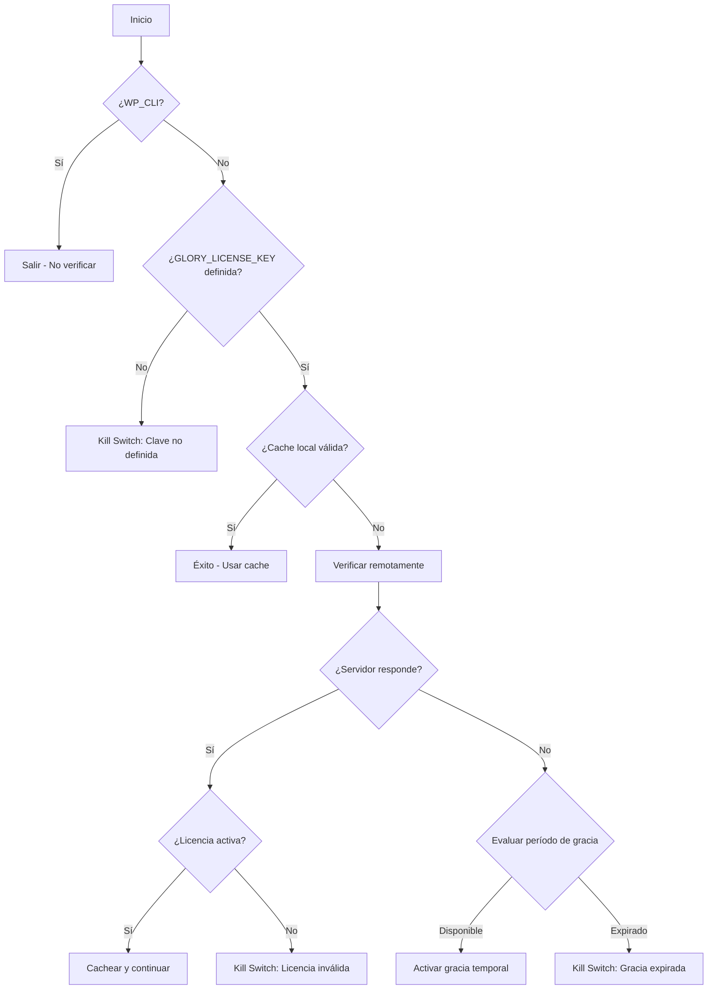

import { Steps, Tabs, TabItem, Aside } from '@astrojs/starlight/components';

# LicenseManager

El **LicenseManager** es el sistema de gestión de licencias de Glory Framework. Garantiza que solo instalaciones autorizadas puedan utilizar el framework, implementando un sistema robusto de verificación remota con características de tolerancia a fallos.

## Filosofía

LicenseManager está diseñado para ser:
- **Seguro**: Verificación remota obligatoria para funcionamiento
- **Resiliente**: Período de gracia ante fallos de conectividad
- **Transparente**: Logging detallado de todas las operaciones
- **No intrusivo**: Impacto mínimo en el rendimiento normal

## Arquitectura

### Componentes Principales

- **Verificación automática**: Se ejecuta en cada carga del sitio
- **Cache local**: Evita verificaciones excesivas al servidor
- **Período de gracia**: Funcionamiento temporal sin conexión
- **Kill switch**: Bloqueo completo ante licencias inválidas
- **Logging integrado**: Seguimiento completo de operaciones

### Estados de Licencia

- **Active**: Licencia válida y verificada
- **Invalid**: Licencia rechazada por el servidor
- **Unknown**: Estado inicial o sin verificación previa
- **Grace Period**: Funcionamiento temporal sin verificación

## Configuración Inicial

### Definir la Clave de Licencia

```php
// En wp-config.php o functions.php
define('GLORY_LICENSE_KEY', 'tu_clave_de_licencia_aqui');
```

### Inicialización del Servicio

```php
use Glory\Services\LicenseManager;

// Inicializar el gestor de licencias
LicenseManager::init();
```

<Aside type="caution">
**Importante**: La constante `GLORY_LICENSE_KEY` debe definirse antes de que LicenseManager se inicialice. Sin ella, el sitio se bloqueará inmediatamente.
</Aside>

## Flujo de Verificación

### Proceso Normal



### Estados del Cache

- **Válido**: Se usa directamente, sin contacto con servidor
- **Expirado**: Se verifica remotamente
- **Vacío**: Primera verificación o error previo

## Uso Programático

### Verificación Manual

```php
// Forzar verificación inmediata (útil para debugging)
LicenseManager::verifyLicense();

// Nota: Normalmente no necesitas llamar esto manualmente
// ya que se ejecuta automáticamente en after_setup_theme
```

### Verificar Estado Actual

```php
// Obtener datos del último check
$licenseData = get_option('glory_license_status_v2_data', [
    'last_check' => 0,
    'status' => 'unknown'
]);

$ultimoCheck = $licenseData['last_check'];
$estadoActual = $licenseData['status'];

// Verificar si está en período de gracia
$enCache = get_transient('glory_license_status_v2');
$esGracia = ($enCache === 'active' && $estadoActual !== 'active');
```

### Debugging y Monitoreo

```php
// Ver logs de verificación (requiere GloryLogger)
use Glory\Core\GloryLogger;

// Los logs se escriben automáticamente en cada verificación
// Busca en los logs por "LICENSE_CHECK" para seguimiento

// Ejemplo de log de éxito:
GloryLogger::info('LICENSE_CHECK_SUCCESS: Licencia activada/verificada remotamente.');

// Ejemplo de log de error:
GloryLogger::error('LICENSE_CHECK_FAIL: El servidor devolvió un estado no válido.', ['status' => 'expired']);
```

## Configuración Avanzada

### Personalizar Intervalos

```php
// En un tema hijo o plugin personalizado
class LicenseManagerPersonalizado extends Glory\Services\LicenseManager
{
    private const CHECK_INTERVAL = 6 * HOUR_IN_SECONDS;  // Verificar cada 6 horas
    private const GRACE_PERIOD = 3 * DAY_IN_SECONDS;     // 3 días de gracia

    // Override methods as needed...
}
```

### Modificar Endpoint de API

```php
// Para desarrollo local o testing
class LicenseManagerDesarrollo extends Glory\Services\LicenseManager
{
    private const LICENSE_API_URL = 'https://dev-api.wandori.us/wp-json/licensing/v1/verify';

    // Resto de métodos heredados...
}
```

### Integración con Sistemas Externos

```php
// Hook para acciones personalizadas en verificación
add_action('glory_license_verified', function($status, $data) {
    if ($status === 'active') {
        // Licencia verificada exitosamente
        update_option('mi_plugin_activado', true);

        // Notificar a servicios externos
        wp_remote_post('https://mi-api.com/license/notify', [
            'body' => ['site' => home_url(), 'status' => 'activated']
        ]);
    }
}, 10, 2);

// Hook para errores de licencia
add_action('glory_license_failed', function($error, $context) {
    // Log personalizado
    error_log("Error de licencia Glory: {$error}");

    // Notificar administrador
    wp_mail(
        get_option('admin_email'),
        'Error de Licencia Glory',
        "Error: {$error}\nContexto: " . json_encode($context)
    );
}, 10, 2);
```

## Gestión de Errores

### Tipos de Error Comunes

#### 1. Clave de Licencia No Definida
```php
// Error: "La constante GLORY_LICENSE_KEY no está definida"
define('GLORY_LICENSE_KEY', 'tu_clave_real_aqui');
```

#### 2. Servidor Inaccesible
- **Solución automática**: Se activa período de gracia
- **Duración**: 7 días desde último check exitoso
- **Comportamiento**: Funcionamiento normal temporal

#### 3. Licencia Inválida
- **Estado**: Kill switch activado
- **Frontend**: Página de error 503
- **Admin**: Notificación de error visible

#### 4. JSON Malformado
```php
// Verificar respuesta del servidor
$response = wp_remote_get('https://wandori.us/wp-json/licensing/v1/status');
if (!is_wp_error($response)) {
    $data = json_decode(wp_remote_retrieve_body($response), true);
    if (json_last_error() === JSON_ERROR_NONE) {
        // Respuesta válida
    }
}
```

### Recuperación de Errores

#### Resetear Cache Manualmente

```php
// Para forzar nueva verificación (usar con cuidado)
delete_transient('glory_license_status_v2');
delete_option('glory_license_status_v2_data');

// Luego recargar la página
LicenseManager::verifyLicense();
```

#### Verificar Conectividad

```php
// Test manual de conectividad
$test = wp_remote_get('https://wandori.us/wp-json/licensing/v1/ping');
if (is_wp_error($test)) {
    echo 'Error de conectividad: ' . $test->get_error_message();
} else {
    echo 'Conectividad OK - Código: ' . wp_remote_retrieve_response_code($test);
}
```

## Casos de Uso

### Instalación en Producción

```php
// wp-config.php - Producción
define('GLORY_LICENSE_KEY', 'prod_license_key_here');

// functions.php
add_action('after_setup_theme', function() {
    // Inicializar Glory
    Glory\Services\LicenseManager::init();

    // Otros servicios de Glory...
}, 1);
```

### Entorno de Desarrollo

```php
// wp-config.php - Desarrollo
if (defined('WP_DEBUG') && WP_DEBUG) {
    // Licencia de desarrollo (si aplica)
    define('GLORY_LICENSE_KEY', 'dev_license_key_here');
} else {
    define('GLORY_LICENSE_KEY', 'prod_license_key_here');
}
```

### Multisite

```php
// Para instalaciones multisite
add_action('after_setup_theme', function() {
    if (is_main_site()) {
        LicenseManager::init();
    }
}, 1);
```

### Plugins que Extienden Glory

```php
// En tu plugin
class MiPluginExtiendeGlory
{
    public function __construct()
    {
        // Verificar que Glory esté disponible y licenciado
        add_action('after_setup_theme', [$this, 'init'], 5);
    }

    public function init()
    {
        // Verificar que la licencia de Glory esté activa
        $licenseStatus = get_transient('glory_license_status_v2');

        if ($licenseStatus !== 'active') {
            add_action('admin_notices', function() {
                echo '<div class="notice notice-warning">
                    <p>Mi Plugin requiere Glory Framework con licencia activa.</p>
                </div>';
            });
            return;
        }

        // Inicializar funcionalidad del plugin
        $this->setupFeatures();
    }
}
```

## Mejores Prácticas

### 1. Configuración Segura

```php
// ❌ Mal: Clave en código versionado
define('GLORY_LICENSE_KEY', 'clave_hardcodeada'); // NUNCA HACER ESTO

// ✅ Bien: Usar variables de entorno o constantes no versionadas
define('GLORY_LICENSE_KEY', getenv('GLORY_LICENSE_KEY') ?: 'clave_por_defecto_segura');
```

### 2. Monitoreo Continuo

```php
// Añadir health check a tu sistema de monitoreo
add_action('wp_ajax_health_check', function() {
    $licenseStatus = get_transient('glory_license_status_v2');
    $lastCheck = get_option('glory_license_status_v2_data', ['last_check' => 0]);

    wp_send_json([
        'license_active' => $licenseStatus === 'active',
        'last_check' => $lastCheck['last_check'],
        'time_since_check' => time() - $lastCheck['last_check']
    ]);
});
```

### 3. Logging Personalizado

```php
// Extender logging para necesidades específicas
add_action('glory_license_verified', function($status, $data) {
    if (defined('GLORY_CUSTOM_LOG')) {
        error_log(sprintf(
            '[GLORY_LICENSE] %s - Status: %s - Domain: %s',
            date('Y-m-d H:i:s'),
            $status,
            home_url()
        ));
    }
}, 10, 2);
```

### 4. Backup y Recovery

```php
// Sistema de backup de estado de licencia
function backup_license_status() {
    $status = get_transient('glory_license_status_v2');
    $data = get_option('glory_license_status_v2_data');

    update_option('glory_license_backup', [
        'status' => $status,
        'data' => $data,
        'timestamp' => time()
    ]);
}

// Restaurar desde backup (usar con precaución)
function restore_license_status() {
    $backup = get_option('glory_license_backup');
    if ($backup) {
        set_transient('glory_license_status_v2', $backup['status'], HOUR_IN_SECONDS);
        update_option('glory_license_status_v2_data', $backup['data']);
    }
}
```

## Resolución de Problemas

### Problema: Sitio Bloqueado por Kill Switch

**Síntomas:**
- Página de error 503 en frontend
- Notificación de error en admin

**Solución:**
```php
// 1. Verificar definición de clave
if (!defined('GLORY_LICENSE_KEY')) {
    define('GLORY_LICENSE_KEY', 'tu_clave_correcta');
}

// 2. Resetear cache si es necesario
delete_transient('glory_license_status_v2');
delete_option('glory_license_status_v2_data');

// 3. Recargar página para nueva verificación
```

### Problema: Verificaciones Excesivas

**Causa:** Cache no funcionando correctamente

**Solución:**
```php
// Verificar permisos de base de datos
global $wpdb;
$transients_table = $wpdb->prefix . 'options';

// Verificar que transients se pueden escribir
$result = $wpdb->query("SELECT option_value FROM {$transients_table} WHERE option_name LIKE '%transient_glory_license%'");

// Si no hay resultados, verificar configuración de WP
```

### Problema: Período de Gracia No Funciona

**Causa:** Estado anterior no guardado correctamente

**Solución:**
```php
// Forzar un check exitoso para establecer baseline
update_option('glory_license_status_v2_data', [
    'last_check' => time(),
    'status' => 'active'
]);

// Luego simular falla de red para probar grace period
add_filter('pre_http_request', function() {
    return new WP_Error('http_request_failed', 'Simulated network failure');
});
```

<Aside type="tip">
**Consejo**: LicenseManager está diseñado para ser completamente automático. Solo interviene manualmente si hay problemas específicos de configuración o conectividad.
</Aside>

<Aside type="caution">
**Importante**: Nunca modifiques directamente los transients o options de LicenseManager a menos que entiendas completamente las implicaciones de seguridad.
</Aside>
