import { Steps, Tabs, TabItem, Aside } from '@astrojs/starlight.components';

# LocalCriticalCss

El **LocalCriticalCss** es un servicio especializado para la generación local de CSS crítico en entornos WordPress. Utiliza Node.js y la biblioteca Penthouse (con Puppeteer) para analizar páginas web y extraer únicamente el CSS necesario para renderizar el contenido visible inicialmente (above the fold).

## Filosofía

LocalCriticalCss está diseñado para ser:
- **Local**: Funciona sin dependencias externas ni APIs remotas
- **Preciso**: Utiliza renderizado real del navegador para máxima precisión
- **Configurable**: Adaptable a diferentes necesidades de rendimiento
- **Robusto**: Maneja errores gracefully y proporciona logs detallados

## Características Principales

- **Renderizado real**: Usa Puppeteer para renderizar páginas como un navegador real
- **Análisis inteligente**: Extrae solo el CSS necesario para el contenido visible
- **Configuración flexible**: Parámetros ajustables para diferentes escenarios
- **Manejo de JavaScript**: Puede congelar JS dinámico durante la generación
- **Multiplataforma**: Soporte para Windows y sistemas Unix-like
- **Logging integrado**: Registra todas las operaciones con GloryLogger

## Arquitectura Técnica

### Dependencias del Sistema

**Requisitos mínimos:**
- Node.js 14+ instalado en el servidor
- Acceso al sistema de archivos para ejecutar comandos
- Permisos de ejecución para scripts de Node.js
- Espacio en disco para archivos temporales

**Archivos necesarios:**
```
Glory/tools/critical-css/
├── generateCritical.js    # Script principal de Node.js
└── package.json          # Dependencias del proyecto
```

### Proceso de Generación

```mermaid
graph TD
    A[Recibir URL] --> B[Configurar Puppeteer]
    B --> C[Inyectar parámetro noAjax]
    C --> D[Renderizar página]
    D --> E[Esperar renderWait ms]
    E --> F[Extraer CSS crítico con Penthouse]
    F --> G[Optimizar y limpiar CSS]
    G --> H[Retornar CSS o null si falla]
```



## Configuración Inicial

### Instalación de Dependencias

```bash
# En el directorio del tema
cd Glory/tools/critical-css/
npm install
```

### Variables de Entorno

```php
// Configurar ruta a Node.js (opcional)
putenv('GLORY_CRITICAL_CSS_NODE=/usr/bin/node');

// O en wp-config.php
define('GLORY_CRITICAL_CSS_NODE', '/usr/local/bin/node');
```

### Configuración en WordPress

```php
// El servicio se configura automáticamente a través de GestorCssCritico
// No requiere configuración adicional para uso básico

// Configuración avanzada opcional
add_filter('glory_local_css_config', function($config) {
    return array_merge($config, [
        'timeout' => 90000,      // 90 segundos
        'renderWait' => 1000,    // 1 segundo de espera
        'skipLoadAfter' => 25000 // 25 segundos
    ]);
});
```

## Uso Programático

### Generación Básica

```php
use Glory\Services\LocalCriticalCss;

$url = home_url('/mi-pagina/');
$cssCritico = LocalCriticalCss::generate($url);

if ($cssCritico) {
    echo "CSS crítico generado: " . strlen($cssCritico) . " bytes\n";
    echo "<style>$cssCritico</style>\n";
} else {
    echo "Error al generar CSS crítico\n";
}
```

### Configuración Avanzada

```php
// Generación con configuración personalizada
$config = [
    'url' => 'https://example.com/producto/123/',
    'cssDir' => get_template_directory() . '/assets/css/',
    'timeout' => 120000,     // 2 minutos
    'renderWait' => 1500,    // 1.5 segundos
    'skipLoadAfter' => 30000 // 30 segundos
];

// Ejecutar comando personalizado
$comando = LocalCriticalCss::buildCommand($config);
exec($comando, $output, $returnCode);

if ($returnCode === 0) {
    $css = implode("\n", $output);
    // Procesar CSS generado
}
```

### Integración con Temas

```php
// En functions.php de un tema
class TemaConCssCritico
{
    public static function init()
    {
        // Inyectar CSS crítico si está disponible
        add_action('wp_head', [self::class, 'inyectarCssCritico'], 5);
    }

    public static function inyectarCssCritico()
    {
        // Obtener CSS crítico del GestorCssCritico (que usa LocalCriticalCss)
        $cssCritico = \Glory\Services\GestorCssCritico::getParaPaginaActual();

        if ($cssCritico) {
            echo "<style id=\"critical-css\">$cssCritico</style>\n";

            // Cargar CSS completo de forma asíncrona
            add_action('wp_footer', [self::class, 'cargarCssCompleto']);
        } else {
            // Fallback: cargar CSS normalmente
            wp_enqueue_style('theme-styles', get_stylesheet_uri());
        }
    }

    public static function cargarCssCompleto()
    {
        $cssUrl = get_stylesheet_uri();
        echo "<link rel=\"preload\" href=\"$cssUrl\" as=\"style\" onload=\"this.onload=null;this.rel='stylesheet'\">\n";
        echo "<noscript><link rel=\"stylesheet\" href=\"$cssUrl\"></noscript>\n";
    }
}

TemaConCssCritico::init();
```

## Configuración de Puppeteer

### Parámetros de Renderizado

```javascript
// Configuración típica en generateCritical.js
const puppeteerConfig = {
    headless: true,
    args: [
        '--no-sandbox',
        '--disable-setuid-sandbox',
        '--disable-dev-shm-usage',
        '--disable-accelerated-2d-canvas',
        '--no-first-run',
        '--no-zygote',
        '--single-process', // Importante para algunos servidores
        '--disable-gpu'
    ]
};
```

### Manejo de Contenido Dinámico

```php
// El servicio automáticamente añade ?noAjax=1 para congelar JS dinámico
function prepararUrlParaGeneracion(string $url): string
{
    $parsed = wp_parse_url($url);
    $query = [];

    if (!empty($parsed['query'])) {
        parse_str($parsed['query'], $query);
    }

    // Añadir parámetro para desactivar AJAX
    if (!isset($query['noAjax'])) {
        $query['noAjax'] = '1';
    }

    // Reconstruir URL
    $scheme = $parsed['scheme'] ?? 'https';
    $host = $parsed['host'] ?? '';
    $port = isset($parsed['port']) ? (':' . $parsed['port']) : '';
    $path = $parsed['path'] ?? '/';
    $newQuery = http_build_query($query, '', '&');
    $fragment = isset($parsed['fragment']) ? ('#' . $parsed['fragment']) : '';

    return $scheme . '://' . $host . $port . $path .
           ($newQuery ? ('?' . $newQuery) : '') . $fragment;
}
```

## Optimizaciones de Rendimiento

### Configuración Recomendada

```php
// Configuración balanceada para rendimiento
$optimaConfig = [
    'timeout' => 60000,      // 60 segundos máximo
    'renderWait' => 800,     // 800ms para estabilización
    'skipLoadAfter' => 20000 // 20 segundos para carga completa
];

// Para páginas complejas (e-commerce, etc.)
$complejaConfig = [
    'timeout' => 120000,     // 2 minutos
    'renderWait' => 2000,    // 2 segundos
    'skipLoadAfter' => 30000 // 30 segundos
];

// Para páginas simples
$simpleConfig = [
    'timeout' => 30000,      // 30 segundos
    'renderWait' => 500,     // 500ms
    'skipLoadAfter' => 10000 // 10 segundos
];
```

### Cache Inteligente

```php
// El GestorCssCritico ya implementa cache automático
// Configuración de expiración
const CSS_CACHE_EXPIRATION = DAY_IN_SECONDS; // 24 horas

// Invalidación automática
add_action('save_post', function($postId) {
    if (wp_is_post_revision($postId)) return;

    $cacheKey = 'glory_critical_css_' . $postId;
    delete_transient($cacheKey);
});
```

## Manejo de Errores

### Tipos de Error Comunes

```php
class ErrorHandlerCssCritico
{
    public static function manejarError($error, $url)
    {
        $tipoError = self::clasificarError($error);

        switch ($tipoError) {
            case 'node_not_found':
                self::manejarNodeNoEncontrado();
                break;

            case 'timeout':
                self::manejarTimeout($url);
                break;

            case 'network_error':
                self::manejarErrorRed($url);
                break;

            case 'css_empty':
                self::manejarCssVacio($url);
                break;

            default:
                self::manejarErrorGenerico($error, $url);
        }
    }

    private static function clasificarError($error)
    {
        $errorStr = strtolower((string)$error);

        if (strpos($errorStr, 'node') !== false && strpos($errorStr, 'not found') !== false) {
            return 'node_not_found';
        }

        if (strpos($errorStr, 'timeout') !== false) {
            return 'timeout';
        }

        if (strpos($errorStr, 'net::') !== false || strpos($errorStr, 'connection') !== false) {
            return 'network_error';
        }

        if (strpos($errorStr, 'empty') !== false || strpos($errorStr, 'no css') !== false) {
            return 'css_empty';
        }

        return 'generic';
    }

    private static function manejarNodeNoEncontrado()
    {
        GloryLogger::error('LocalCriticalCss: Node.js no encontrado en el sistema');
        // Notificar administrador
        add_action('admin_notices', function() {
            echo '<div class="notice notice-error"><p>Node.js no encontrado. Instale Node.js para usar CSS crítico local.</p></div>';
        });
    }

    private static function manejarTimeout($url)
    {
        GloryLogger::warning('LocalCriticalCss: Timeout generando CSS para URL', ['url' => $url]);
        // Intentar con configuración más agresiva en el futuro
    }

    private static function manejarErrorRed($url)
    {
        GloryLogger::error('LocalCriticalCss: Error de red accediendo a URL', ['url' => $url]);
        // Verificar conectividad del servidor
    }

    private static function manejarCssVacio($url)
    {
        GloryLogger::warning('LocalCriticalCss: CSS vacío generado', ['url' => $url]);
        // Posible problema con el renderizado o CSS mal estructurado
    }
}
```

### Logging y Debugging

```php
// Logging automático de todas las operaciones
// Ejemplos de logs generados:

// [INFO] LocalCriticalCss: ejecutando generador (node: /usr/bin/node, url: https://example.com/)
// [ERROR] LocalCriticalCss: fallo ejecutando generador (rc: 1, out: Error details...)
// [INFO] LocalCriticalCss: CSS crítico generado exitosamente (bytes: 15432)
// [WARNING] LocalCriticalCss: script no encontrado (path: /path/to/generateCritical.js)
```

### Debug Mode

```php
// Función de debugging para desarrollo
function debug_local_css()
{
    if (!WP_DEBUG || !current_user_can('manage_options')) {
        return;
    }

    $url = home_url(add_query_arg([], $_SERVER['REQUEST_URI'] ?? '/'));
    $css = LocalCriticalCss::generate($url);

    echo "<!-- DEBUG LOCAL CSS CRÍTICO\n";
    echo "URL: $url\n";

    if ($css) {
        echo "CSS generado: SÍ (" . strlen($css) . " bytes)\n";
        echo "Preview: " . substr($css, 0, 100) . "...\n";
    } else {
        echo "CSS generado: NO\n";
    }

    // Verificar Node.js
    $node = getenv('GLORY_CRITICAL_CSS_NODE') ?: 'node';
    exec("$node --version 2>&1", $output, $code);
    echo "Node.js: " . ($code === 0 ? implode('', $output) : 'NO ENCONTRADO') . "\n";

    // Verificar script
    $script = get_template_directory() . '/Glory/tools/critical-css/generateCritical.js';
    echo "Script existe: " . (file_exists($script) ? 'SÍ' : 'NO') . "\n";

    echo "-->\n";
}
add_action('wp_footer', 'debug_local_css');
```

## Casos de Uso Avanzados

### Generación Condicional

```php
class CssCriticoInteligente
{
    public static function generarCssInteligente(string $url): ?string
    {
        // No generar para páginas administrativas
        if (is_admin() || wp_doing_ajax()) {
            return null;
        }

        // No generar para usuarios no autenticados en desarrollo
        if (WP_DEBUG && !is_user_logged_in()) {
            return null;
        }

        // Generar con configuración basada en el tipo de página
        $config = self::determinarConfigPorTipoPagina($url);

        return LocalCriticalCss::generate($url, $config);
    }

    private static function determinarConfigPorTipoPagina(string $url): array
    {
        // Configuración para páginas de producto (tiempo extra para carruseles, etc.)
        if (strpos($url, '/producto/') !== false) {
            return [
                'timeout' => 90000,
                'renderWait' => 2000,
                'skipLoadAfter' => 25000
            ];
        }

        // Configuración para home (menos tiempo, contenido estático)
        if ($url === home_url('/')) {
            return [
                'timeout' => 30000,
                'renderWait' => 500,
                'skipLoadAfter' => 10000
            ];
        }

        // Configuración por defecto
        return [
            'timeout' => 60000,
            'renderWait' => 800,
            'skipLoadAfter' => 20000
        ];
    }
}
```

### Integración con Build Process

```php
// Generar CSS crítico durante el despliegue
class BuildProcessCssCritico
{
    public static function generarCssParaDespliegue()
    {
        $urls = [
            home_url('/'),
            home_url('/acerca-de/'),
            home_url('/contacto/'),
            // Agregar más URLs según necesidad
        ];

        $resultados = [];
        foreach ($urls as $url) {
            $css = LocalCriticalCss::generate($url);
            if ($css) {
                $filename = 'critical-' . md5($url) . '.css';
                $filepath = get_template_directory() . '/assets/css/critical/' . $filename;

                if (file_put_contents($filepath, $css)) {
                    $resultados[$url] = [
                        'success' => true,
                        'file' => $filename,
                        'bytes' => strlen($css)
                    ];
                } else {
                    $resultados[$url] = ['success' => false, 'error' => 'No se pudo guardar archivo'];
                }
            } else {
                $resultados[$url] = ['success' => false, 'error' => 'No se pudo generar CSS'];
            }
        }

        // Guardar resultados para análisis posterior
        file_put_contents(
            get_template_directory() . '/css-critical-build-results.json',
            json_encode($resultados, JSON_PRETTY_PRINT)
        );

        return $resultados;
    }
}

// Ejecutar durante el build (manual o automatizado)
add_action('wp_cli_init', function() {
    WP_CLI::add_command('css-critical build', function() {
        $resultados = BuildProcessCssCritico::generarCssParaDespliegue();
        WP_CLI::success('CSS crítico generado para ' . count($resultados) . ' URLs');
    });
});
```

### Monitoreo de Rendimiento

```php
class MonitorCssCritico
{
    public static function init()
    {
        add_action('glory_css_critical_generated', [self::class, 'registrarGeneracion'], 10, 2);
        add_action('glory_css_critical_failed', [self::class, 'registrarFallo'], 10, 2);
    }

    public static function registrarGeneracion(string $url, int $bytes)
    {
        $stats = get_option('glory_css_critical_stats', []);
        $stats['generations'][] = [
            'url' => $url,
            'bytes' => $bytes,
            'timestamp' => time(),
            'success' => true
        ];

        // Mantener solo las últimas 1000 generaciones
        if (count($stats['generations']) > 1000) {
            $stats['generations'] = array_slice($stats['generations'], -1000);
        }

        update_option('glory_css_critical_stats', $stats);
    }

    public static function registrarFallo(string $url, string $error)
    {
        $stats = get_option('glory_css_critical_stats', []);
        $stats['failures'][] = [
            'url' => $url,
            'error' => $error,
            'timestamp' => time()
        ];

        update_option('glory_css_critical_stats', $stats);
    }

    public static function obtenerEstadisticas()
    {
        $stats = get_option('glory_css_critical_stats', ['generations' => [], 'failures' => []]);

        $totalGenerations = count($stats['generations']);
        $totalFailures = count($stats['failures']);
        $tasaExito = $totalGenerations > 0 ? (($totalGenerations / ($totalGenerations + $totalFailures)) * 100) : 0;

        $bytesPromedio = 0;
        if ($totalGenerations > 0) {
            $totalBytes = array_sum(array_column($stats['generations'], 'bytes'));
            $bytesPromedio = $totalBytes / $totalGenerations;
        }

        return [
            'total_generations' => $totalGenerations,
            'total_failures' => $totalFailures,
            'success_rate' => round($tasaExito, 2),
            'average_bytes' => round($bytesPromedio),
            'last_generation' => end($stats['generations'])
        ];
    }
}

MonitorCssCritico::init();
```

## Solución de Problemas

### Node.js no encontrado

**Error:** `node: command not found`
**Soluciones:**
```bash
# Instalar Node.js
curl -fsSL https://deb.nodesource.com/setup_18.x | sudo -E bash -
sudo apt-get install -y nodejs

# O especificar ruta completa
putenv('GLORY_CRITICAL_CSS_NODE=/usr/local/bin/node');
```

### Timeout en generación

**Error:** Generación se detiene después de 60 segundos
**Soluciones:**
```php
// Aumentar timeout
add_filter('glory_local_css_config', function($config) {
    $config['timeout'] = 120000; // 2 minutos
    return $config;
});
```

### CSS vacío generado

**Posibles causas:**
- Página no carga completamente
- Contenido dinámico no renderizado
- Errores de JavaScript bloquean renderizado

**Diagnóstico:**
```php
// Verificar que la página sea accesible
$url = 'https://example.com/';
$response = wp_remote_get($url);

if (is_wp_error($response)) {
    echo "Error accediendo a la URL\n";
} else {
    echo "URL accesible, código: " . wp_remote_retrieve_response_code($response) . "\n";
}
```

### Problemas de memoria

**Error:** Puppeteer se queda sin memoria
**Soluciones:**
```javascript
// En generateCritical.js, agregar límites de memoria
const browser = await puppeteer.launch({
    headless: true,
    args: [
        '--no-sandbox',
        '--disable-setuid-sandbox',
        '--disable-dev-shm-usage',
        '--max_old_space_size=4096' // 4GB límite
    ]
});
```

## Mejores Prácticas

### Configuración de Producción

```php
// Configuración recomendada para producción
$configProduccion = [
    'timeout' => 45000,      // 45 segundos (balanceado)
    'renderWait' => 1000,    // 1 segundo
    'skipLoadAfter' => 15000 // 15 segundos
];

// Monitoreo de recursos
add_action('glory_css_critical_generated', function($url, $bytes) {
    if ($bytes > 50000) { // CSS muy grande
        GloryLogger::warning('CSS crítico muy grande generado', [
            'url' => $url,
            'bytes' => $bytes
        ]);
    }
}, 10, 2);
```

### Mantenimiento del Sistema

```php
// Limpiar procesos huérfanos de Node.js
function limpiarProcesosNode()
{
    if (PHP_OS_FAMILY === 'Linux') {
        exec('pkill -f "node.*generateCritical"', $output, $code);
        if ($code === 0) {
            GloryLogger::info('Procesos Node.js huérfanos limpiados');
        }
    }
}

// Ejecutar semanalmente
add_action('wp_schedule_event', 'limpiarProcesosNode');
wp_schedule_event(time(), 'weekly', 'limpiar_procesos_node');
```

### Optimización de Cache

```php
// Estrategia de cache inteligente
function estrategiaCacheCssCritico(string $url): string
{
    // Cache por host
    $host = wp_parse_url($url, PHP_URL_HOST);
    $cacheKey = 'glory_css_' . md5($host . $_SERVER['REQUEST_URI']);

    // Expiración basada en tipo de contenido
    $expiration = self::determinarExpiracion($url);

    return $cacheKey;
}

private static function determinarExpiracion(string $url): int
{
    // Contenido estático: 1 semana
    if (is_front_page() || is_page()) {
        return WEEK_IN_SECONDS;
    }

    // Contenido dinámico: 1 día
    if (is_single() || is_archive()) {
        return DAY_IN_SECONDS;
    }

    // Por defecto: 12 horas
    return 12 * HOUR_IN_SECONDS;
}
```

<Aside type="caution">
⚠️ **Importante**: LocalCriticalCss ejecuta comandos del sistema y requiere Node.js. Asegúrate de que tu servidor tenga los permisos y recursos necesarios. Monitorea el uso de memoria y CPU durante la generación.
</Aside>

<Aside type="tip">
💡 **Tip**: Para mejores resultados, combina LocalCriticalCss con un sistema de cache distribuido (Redis, Memcached) y configura monitores de rendimiento para detectar degradaciones en la generación.
</Aside>
